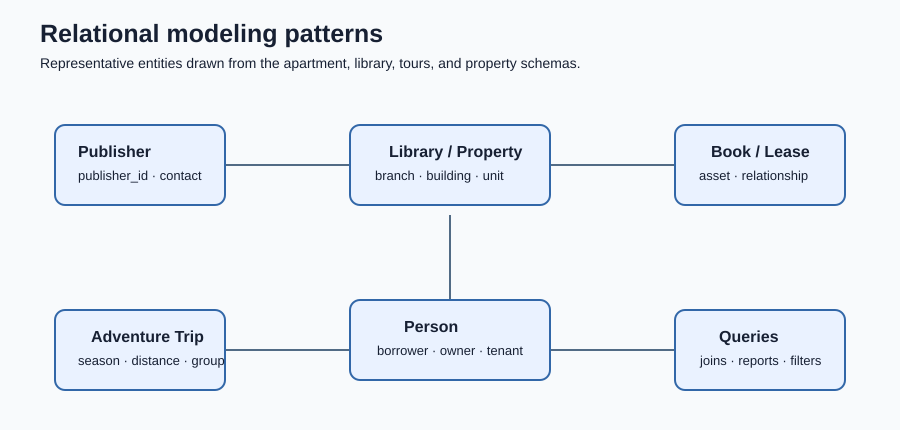

# CIT 21400 Database Projects

SQL coursework demonstrating relational schema design, normalization, constraints, data loading, and query development.



The diagram summarizes the entity-and-relationship patterns repeated across the assignments. Each SQL file remains self-contained so the schemas can be reviewed independently.

## Projects

| File | Demonstrates |
| --- | --- |
| [`assignment-2-apartment-rental.sql`](sql/assignment-2-apartment-rental.sql) | Multi-table apartment-rental schema, primary/foreign keys, and relational queries |
| [`colonial-adventure-tours.sql`](sql/colonial-adventure-tours.sql) | Adventure-tour data model, inserts, joins, and reporting queries |
| [`library-database-final-project.sql`](sql/library-database-final-project.sql) | Library publishers, branches, books, borrowers, and lending relationships |
| [`consulting-database.sql`](sql/consulting-database.sql) | Consultant/client/project schema and sample business data |
| [`staywell-property-management.sql`](sql/staywell-property-management.sql) | Property-management entities, leases, owners, and maintenance data |
| [`mysql-premiere-exercises.sql`](sql/mysql-premiere-exercises.sql) | Query practice against a small retail schema |

## Technology

- MySQL / SQL
- Relational modeling
- DDL and DML
- Primary and foreign-key constraints
- Joins, aggregation, filtering, and reporting queries

## Visual review

The relationship map is a static, repository-generated visual rather than a screenshot of a database client. It keeps the README readable while the SQL files provide the authoritative implementation.

## Running the scripts

Each script is self-contained or begins by selecting its database. Review the file before execution, then run it in MySQL Workbench or the MySQL CLI. These scripts use sample textbook-style data; no personal production data is included.

```bash
mysql -u <username> -p < sql/assignment-2-apartment-rental.sql
```

## Course context

Completed for CIT 21400, Introduction to Data Management. The repository is organized as a portfolio of database assignments and exercises; it is not intended to represent a production database deployment.

## About

Built by Ahmed Balde as part of a broader portfolio in software engineering, data, cybersecurity, and GIS.
